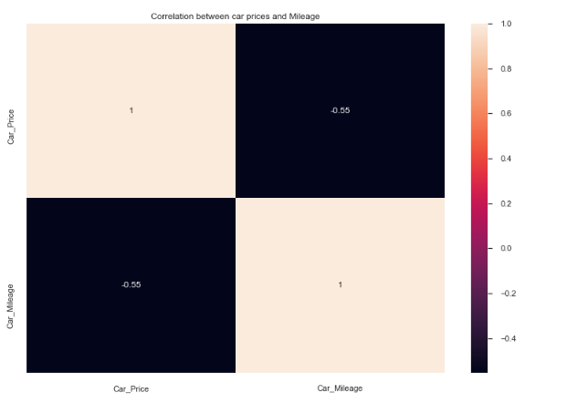

# Car Price Estimator: Data Science Project Overview

- Created a tool that estimates car prices (MAE ~ £400) to help car owners/buyers to negotiate the deal. 
- Scraped over 8000 car listing from auto trade using python and beatuifulsoup
- Optimized Linear, Lasso, Decision Tree and Random Forest Regressors using GridsearchCV to reach the best model.

# Code and Resources Used

**Python Version**: 3.7

**Packages**: pandas, numpy, sklearn, matplotlib, seaborn,json, pickle

**Scraper Resource**: https://stackoverflow.com/questions/60012952/how-to-code-a-for-loop-in-python-for-a-web-scraper

# Web Scraping

I scraped over 8000 Car listing from autotrade.com. With each listing, we got the following:

- Title
- Price
- Mileage
- Make
- BHP
- Engine Size
- Type of Vehicle
- Type of Gearbox
- Type of Fuel (Petrol,Diesel or Hybrid)
- Year 

# Data Cleaning
After downloading the data, I needed to clean it up so that it was usable for our model. I made the following changes and created the following variables:

# EDA

 

 

# Model 
First, I transformed the categorical variables into dummy variables. I also split the data into train and tests sets with a test size of 25%.

I tried four different models and evaluated them using Mean Absolute Error.  I chose MAE because it is relatively easy to interpret and outliers aren’t particularly bad in for this type of model.

I tried four different models:

Lasso  – Baseline for the model

Decision Tree and kneighborsclassifier 

Random Forest – Again, with the sparsity associated with the data, I thought that this would be a good fit.

# Evalution

The Random Forest model far outperformed the other approaches on the test and validation sets.

Random Forest : MAE = 479
Decision Tree MAE = 1760
Lasso Regression: MAE = 1609
